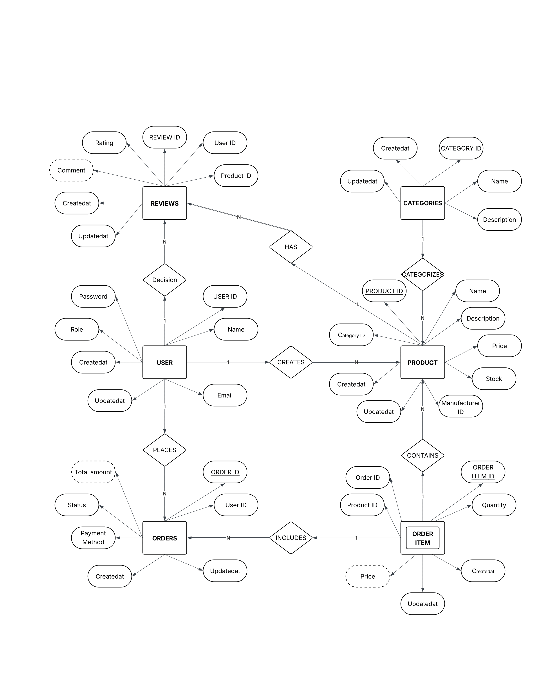

# Supply Chain Management System

 I made this project for Database Management Systems (DBMS) and Web Development. This project contains theoretical as well as implementation in backend-Node.js/Express and FrontEnd-React.js.


## *** FrontEnd ***

Frontend implementation of a Supply Chain Management platform built using React.js and Material-UI. It provides users with an intuitive interface to manage inventory, track orders, and optimize supply chain operations. Leveraging React's component-based architecture and context API for state management, it offers a seamless user experience with dynamic updates and efficient data flow.

### Key Features

- **User Authentication**: Secure authentication and registration functionalities with role-based access control.
- **Theme Customization**: Light and dark mode support with a beautiful cosmic-themed landing page.
- **Dashboard**: Comprehensive dashboard for monitoring supply chain metrics and activities.
- **Inventory Management**: Track and manage inventory levels across the supply chain.
- **Order Tracking**: Monitor orders from placement to delivery with detailed status updates.
- **Supplier Management**: Build and maintain strong relationships with suppliers through our integrated platform.


### Application Screenshots

#### Landing Page

- Beautiful cosmic-themed landing page with 3D star animations and theme-responsive SVG illustrations
- Dynamic color-changing feature cards that respond to user interaction
- Theme toggle functionality with smooth transitions
- Call-to-action buttons for registration and login
- Animated background elements that respond to scroll position

#### Login Page

- User authentication with email and password
- Theme-aware styling for better user experience
- Error handling and validation

#### Register Page

- User registration with name, email, and password
- Theme-aware styling for better user experience
- Error handling and validation

#### Dashboard

- Overview of supply chain metrics with interactive cards
- Quick access to key functionalities with role-based navigation
- Real-time updates on inventory and orders
- Tabbed interface for easy navigation between different sections
- Interactive tables for products, orders, suppliers, and shipments
- Database schema visualization with expandable sections
- **Dashboard Tables**:
  - **Products Table**: Display and manage product inventory with fields for name, category, price, and stock
  - **Categories Table**: Organize products with name and description fields
  - **Orders Table**: Track customer orders with order ID, customer, amount, status, and date
  - **Suppliers Table**: Manage supplier information with name, contact, email, and phone
  - **Shipments Table**: Monitor shipment status with shipment ID, order ID, status, origin, destination, and expected delivery
  - **Database Schema Table**: Visualize database structure with tables, fields, and relationships
  - **Entity Attributes Table**: View entity details with attributes, types, and relationships

#### Inventory Management

- Add, edit, and delete inventory items
- Track stock levels and reorder points
- Filter and search functionality

#### Order Management

- Create and track orders
- View order history and status
- Filter and search functionality


## *** BackEnd ***

### Pre-requisite
- Node.js
- MySQL/MariaDB
- npm or yarn

### Contents

1. Project Description
2. Basic structure
3. Functional requirements
4. Entity Relation (ER) diagram and constraints
5. Relational database schema
6. Implementation
   - Creating tables
   - Inserting data
   - Queries
     - Basic queries
     - PL/SQL function
     - Trigger function
     - Stored procedures
     - Functions

### 1. Project Description

In today's globalized economy, efficient supply chain management is crucial for businesses to remain competitive. This project aims to create a comprehensive Supply Chain Management System that helps businesses streamline their operations, reduce costs, and improve customer satisfaction.

The Prime Objective of our database project is to design a robust Supply Chain Management database by performing operations such as:

- Tracking inventory levels
- Managing supplier relationships
- Processing and fulfilling orders
- Monitoring supply chain performance
- Maintaining data consistency across tables

### 2. REQUIREMENTS

- Users can register and login with different roles (Admin, Manufacturer, Consumer)
- Users can view and update their profile information
- Users can search for products according to category, brand, or price
- Users can add products to their cart and view the total amount
- Users can update or remove items from their cart
- Users can choose different payment methods
- Users can track their orders by viewing order status
- Users can review products they have purchased
- Manufacturers can update product availability and stock levels
- Manufacturers can track total sales of their products
- Manufacturers can view sales reports by day, month, or year
- Admins can manage users, products, and orders

#### 2.1 Functional Requirements

- Users can only access data relevant to their role
- Data consistency must be maintained across all tables
- No data loss should occur during transactions
- The system should handle concurrent users efficiently

### 3. Relational Database Schema

#### Users Table
- UserID (PK)
- Name
- Email
- Password
- Role
- CreatedAt
- UpdatedAt

#### Products Table
- ProductID (PK)
- Name
- Description
- Price
- Stock
- ManufacturerID (FK)
- CategoryID (FK)
- CreatedAt
- UpdatedAt

#### Categories Table
- CategoryID (PK)
- Name
- Description
- CreatedAt
- UpdatedAt

#### Orders Table
- OrderID (PK)
- UserID (FK)
- TotalAmount
- Status
- PaymentMethod
- CreatedAt
- UpdatedAt

#### OrderItems Table
- OrderItemID (PK)
- OrderID (FK)
- ProductID (FK)
- Quantity
- Price
- CreatedAt
- UpdatedAt

#### Reviews Table
- ReviewID (PK)
- UserID (FK)
- ProductID (FK)
- Rating
- Comment
- CreatedAt
- UpdatedAt

### 4. Entities and their Attributes

| ENTITIES | ATTRIBUTES | ATTRIBUTE TYPE | Entity Type |
|----------|------------|----------------|-------------|
| User | UserID, Name, Email, Password, Role | Simple | Strong |
| Product | ProductID, Name, Description, Price, Stock, ManufacturerID, CategoryID | Simple | Strong |
| Category | CategoryID, Name, Description | Simple | Strong |
| Order | OrderID, UserID, TotalAmount, Status, PaymentMethod | Simple | Strong |
| OrderItem | OrderItemID, OrderID, ProductID, Quantity, Price | Simple | Weak |
| Review | ReviewID, UserID, ProductID, Rating, Comment | Simple | Strong |

### 5. Entities and Relations

| ENTITIES | RELATION | CARDINALITY | TYPE OF PARTICIPATION |
|----------|----------|-------------|----------------------|
| User | Product | Creates | OneToMany | Partial | Total |
| User | Order | Places | OneToMany | Partial | Total |
| User | Review | Writes | OneToMany | Partial | Total |
| Product | OrderItem | Contains | OneToMany | Partial | Total |
| Order | OrderItem | Includes | OneToMany | Partial | Total |
| Product | Review | Has | OneToMany | Partial | Total |
| Category | Product | Categorizes | OneToMany | Partial | Total |

### 6. ER-Diagram



### 7. QUERIES ON THE ABOVE RELATIONAL SCHEMA

1. Stored procedure for retrieving user details
2. View for getting sales by product category
3. Trigger to update product stock when an order is placed
4. Trigger to update order total when items are added or removed
5. Stored procedure for getting order history
6. Function to process an order

#### Order Processing Logic:
- Check if products are in stock
- Reserve items for the order
- Reduce available quantity
- Inform customer about availability
- Handle payment processing

#### User Management:
- Check if user exists
- Add new user if needed
- Fetch user ID
- Create order record
- Add order items
- Handle rollback on failure

#### Sample Queries:

1. Find products with highest ratings in a category
2. Filter products by brand and price range
3. Calculate total price for all items in a cart
4. Find the best-selling manufacturer for a product
5. List orders to be delivered to a specific location
6. Find products with highest sales on a specific date
7. Identify categories with highest sales on a specific date
8. Find customers who buy most from a specific manufacturer
9. List orders with specific payment methods pending delivery
10. Find orders with total amount above a threshold
11. Modify cart by removing products
12. Find manufacturers with highest stock of a product
13. Compare products based on ratings and reviews

## Installation and Setup

### Backend Setup
```bash
cd server
npm install
npm start
```

### Frontend Setup
```bash
cd client
npm install
npm run dev
```

## Recent Updates

### Enhanced Landing Page
- Added 3D star animation effect that changes based on theme (light/dark)
- Integrated supply-chain-illustration.svg as a background for the title section
- Implemented theme-responsive styling for the illustration
- Added smooth transitions and hover effects for interactive elements

### Improved Dashboard
- Enhanced navigation with proper routing for all dashboard sections
- Added color-changing feature cards with hover effects
- Implemented role-based access control for different sections
- Added database schema visualization with expandable sections
- **Implemented comprehensive dashboard tables**:
  - Products table with add, edit, and delete functionality
  - Categories table for organizing products
  - Orders table for tracking customer orders
  - Suppliers table for managing supplier information
  - Shipments table for monitoring delivery status
  - Database schema visualization with expandable sections
  - Entity attributes visualization with detailed information
- **Added state management** for all dashboard tables
- **Implemented dialog interfaces** for adding and editing items
- **Added role-specific metrics** for different user types

### UI/UX Improvements
- Added smooth animations for tab transitions
- Implemented consistent color schemes across the application
- Enhanced dialog components with theme-specific styling
- Improved responsive design for better mobile experience
- Added interactive tables with hover effects
- Implemented expandable sections for detailed information

## Technologies Used

### Frontend
- React.js
- Material-UI
- Framer Motion
- React Router
- Context API

### Backend
- Node.js
- Express.js
- MySQL/MariaDB
- Sequelize ORM
- JWT Authentication


#  ***** ***Thank You*** *****

